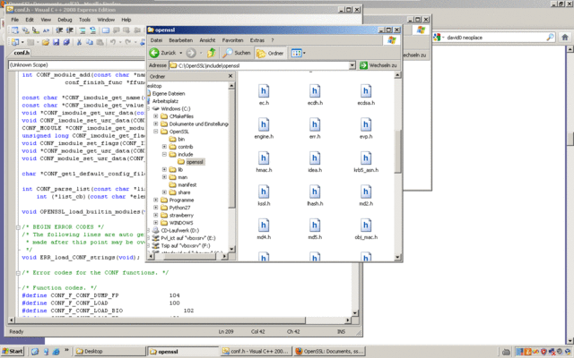

neoplace 
========
a tiling extension for windows
------------------------------

neoplace is a easy to use application that helps you to arrange your windows more efficient. 

Usage
=====
Start it. A tray icon will appear.
Click on the tray icon to open window that helps you to arrange your windows.

Download
========
Click [here](https://github.com/downloads/david0/neoplace/neoplace_v0.4.exe) to download the latest version.

Credits
=======

neoplace was inspired by gTile: <https://extensions.gnome.org/extension/28/gtile/>
